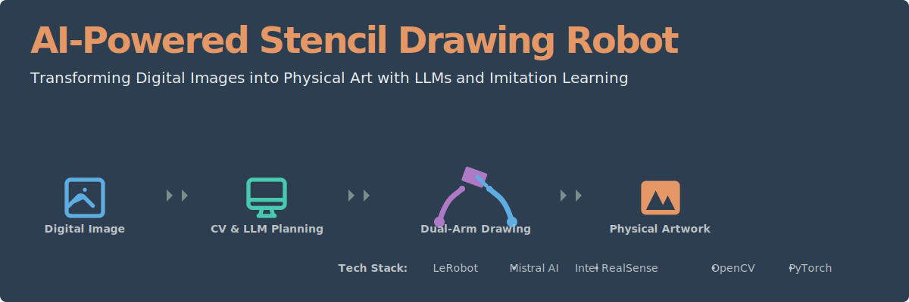

# paintingLeRobot: AI-Powered Stencil Drawing Robot



> A dual-arm robotic system that uses a pipeline of computer vision, large language models, and imitation learning to transform digital images into physical drawings with colored stencils.

This project was developed in 48 hours for the **Munich AI & Robotics Hackathon 2025**.

---

## 🤖 Project Overview

This repository contains the software for an autonomous robotic artist. The system takes any digital image as input, intelligently deconstructs it, plans a drawing strategy, and then uses two **LeRobot** arms to execute the drawing on a piece of paper using a set of physical stencils.

The core workflow is as follows:
1.  **Image Ingestion & Analysis:** A user provides a digital image. Our computer vision pipeline uses a blend of classical OpenCV techniques and a pre-trained StyleGAN to analyze the image, segment it by color, and break it down into a series of drawable vector primitives (lines and curves).
2.  **LLM Task Planning:** These primitives are passed to **Mistral AI**. The large language model acts as the mission planner, generating a high-level, step-by-step sequential plan. This plan optimizes the drawing process, deciding the order of colors and stencils to minimize tool changes and drawing time.
3.  **Perception & Calibration:** An **Intel RealSense D405** depth camera continuously perceives the workspace. It dynamically locates the drawing canvas and the set of available colored stencils, feeding their precise coordinates to the motion planner.
4.  **Dual-Arm Execution:** The drawing plan is executed by two LeRobot arms. Using policies trained via **imitation learning**, the arms can perform delicate manipulation tasks—picking, placing, and orienting stencils—and then trace the lines with a drawing tool, all without direct force feedback.

## ✨ Key Features

* **End-to-End Autonomy:** Fully automated pipeline from a digital `.jpg` or `.png` to a physical, multi-color drawing.
* **LLM-Powered Strategy:** Leverages the power of Mistral AI for high-level reasoning and efficient task sequencing.
* **Advanced 3D Perception:** Utilizes the Intel RealSense D405's RGB and Depth streams for robust object localization and workspace calibration.
* **Imitation-Learned Skills:** Employs policies trained on human demonstrations via the `lerobot` framework for fluid and precise manipulation of stencils and drawing tools.
* **Dual-Arm Coordination:** Designed for a two-arm setup to divide labor, for instance, one arm places the stencil while the other draws, enabling more complex and efficient operation.
* **Visual Servoing (Stretch Goal):** The system is architected to support closed-loop visual feedback to correct for inaccuracies during the drawing process in real-time.

## 🛠️ Tech Stack

### Hardware
* **Robotic Arms:** 2x LeRobot SO-101
* **Camera:** Intel RealSense D405
* **Compute:** PC with an NVIDIA GPU for model training and inference

### Software & Frameworks
* **Primary Language:** Python
* **Robotics:** `lerobot` (Hugging Face), PyTorch
* **AI/ML:** `transformers`, `diffusers`, `scikit-learn`, OpenCV
* **APIs & Cloud:** Mistral AI, Hugging Face Hub (for datasets and models)

## 🚀 Getting Started

### Initial Setup

1.  **Clone the repository:**
    ```bash
    git clone [https://github.com/your-username/ai-robotic-artist.git](https://github.com/your-username/ai-robotic-artist.git)
    cd ai-robotic-artist
    ```
2.  **Install dependencies:**
    ```bash
    pip install -r requirements.txt
    ```
3.  **Install image editing dependencies (optional):**
    ```bash
    python install_dependencies.py
    ```
4.  **Configure Environment:**
    Set up your API keys for Mistral AI and Hugging Face in a `.env` file.
5.  **Run the main application:**
    ```bash
    python main.py --image path/to/your/image.jpg
    ```

### 🎨 Image Generation & Editing Features

This project also includes powerful AI-driven image generation and editing capabilities:

#### Image Generation
Generate stunning images from text descriptions using Google's Imagen model:

```bash
cd image_generation
python imagegen.py
```

Choose option 1 to generate new images from text prompts.

#### Image Editing with Object Detection & Inpainting

Our advanced image editing pipeline combines:
- **YOLO object detection** to identify objects in images
- **Stable Diffusion inpainting** to seamlessly edit selected objects
- **Interactive workflow** for precise editing control

**How it works:**

1. **Object Detection**: The system automatically detects all objects in your image using YOLOv8
2. **Interactive Selection**: Choose which object you want to edit from a numbered list
3. **Guided Editing**: Describe how you want to modify the selected object
4. **AI Inpainting**: Stable Diffusion intelligently repaints the selected area
5. **Result Comparison**: Get the original, detection reference, and edited images

**Usage:**
```bash
cd image_generation
python imagegen.py
```

Choose option 2 for image editing, then:
1. Enter the path to your image file
2. Review the detected objects (saved as reference image)
3. Select the object ID you want to edit
4. Describe your desired changes
5. Wait for the AI to generate your edited image

**Example editing prompts:**
- "Make this car blue instead of red"
- "Turn this cat into a dog"
- "Change this apple to an orange"
- "Make this person wear a hat"

**System Requirements:**
- GPU recommended for faster inference
- ~5GB disk space for Stable Diffusion models (downloaded on first use)
- ~6MB for YOLO model weights (downloaded automatically)

---
*This project represents a proof-of-concept demonstrating the powerful synergy between modern AI techniques and accessible robotic hardware.*
